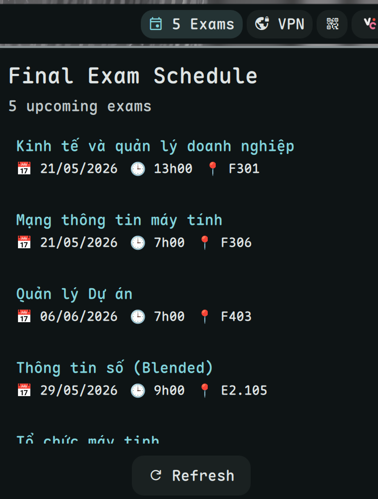

# DUT Exams Plugin for Dank Material Shell



A Dank Material Shell (DMS) widget that displays your final exam schedule from `sv.dut.udn.vn`.

## Features
- **Auto-login**: No more manual cookie copying. Just enter your Student ID and Password.
- **Sync with Enhancer-for-SVDUT**: Uses the same robust parsing logic as the popular userscript.
- **Live Updates**: Automatically refreshes every hour or instantly when credentials are updated.
- **English UI**: Fully localized to match your system language.

## Installation

1. Clone or download this repository to your DMS plugins folder (usually `~/.config/DankMaterialShell/plugins/`).
   ```bash
   git clone https://github.com/hthienloc/dms-dut-exams.git ~/.config/DankMaterialShell/plugins/dut-exams
   ```
2. Ensure you have `python3` installed on your system.

## Configuration

1. Open **DMS Settings** > **Plugins**.
2. Find **DUT Exams** and enable it.
3. Click on the plugin settings and enter your **Student ID** and **Password**.
4. The widget will appear on your panel with the number of upcoming exams.

## Security
Your credentials are stored locally on your machine by Dank Material Shell's configuration system. They are only used to perform a secure login to the official university portal (`https://sv.dut.udn.vn`).

## License
GPLv3 - See [LICENSE](LICENSE) for details.
